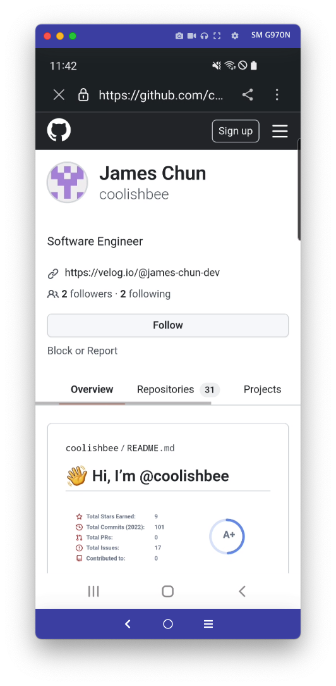

# android-browser-helper

## Usage

```
class MainActivity : AppCompatActivity() {
    override fun onCreate(savedInstanceState: Bundle?) {
        super.onCreate(savedInstanceState)
        setContentView(R.layout.activity_main)

        val customTabsIntent = CustomTabsIntent.Builder().build()
        CustomTabActivityHelper.openCustomTab(
            this,
            customTabsIntent,
            Uri.parse("https://github.com/coolishbee"),
            CustomWebViewFallback()
        )
    }
}
```

## Screenshot

